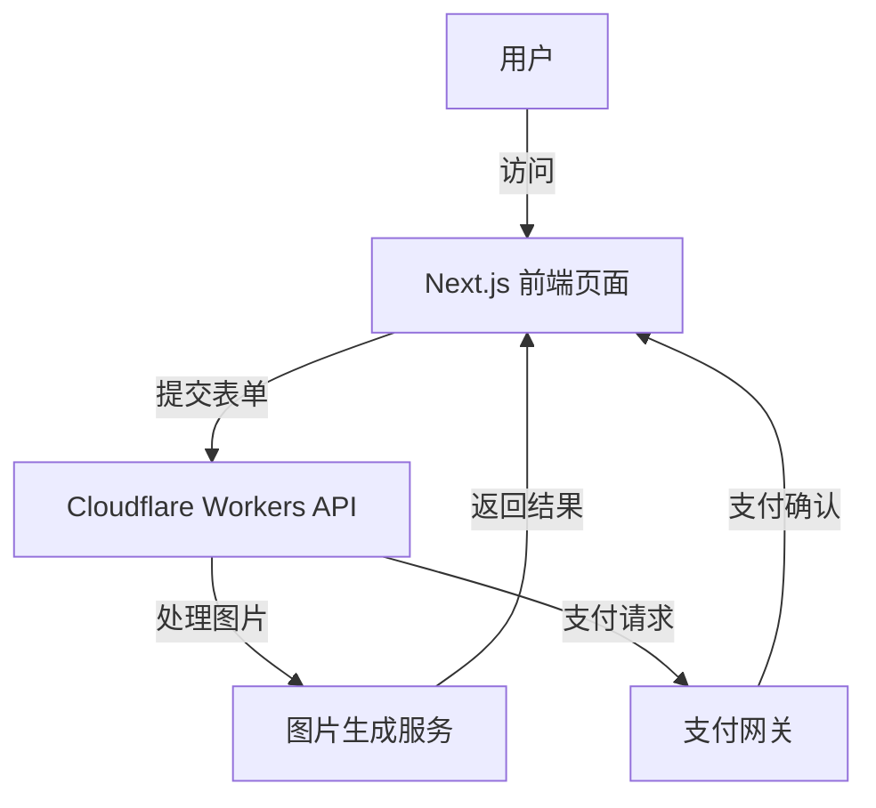
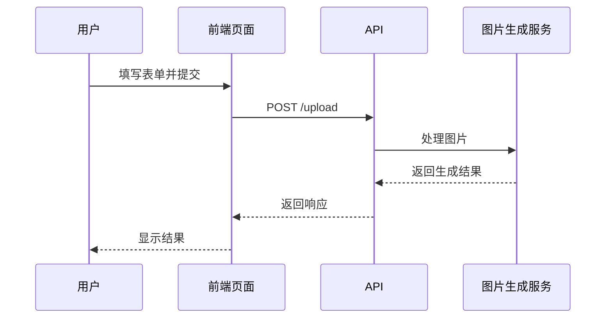
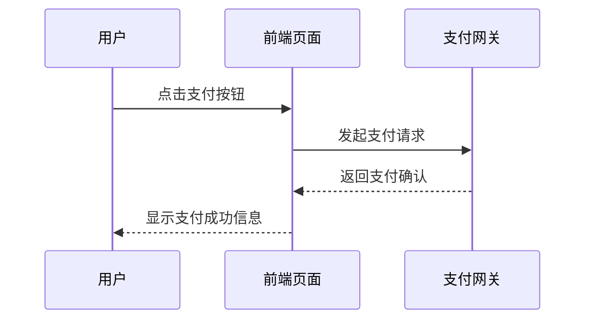

# 项目协作文档

## 项目名称
GenerateGhibli

## 项目简要描述
GenerateGhibli 是一个基于 Next.js 和 Cloudflare Workers 的门户网站，允许用户上传图片并生成 Ghibli 风格的艺术作品。用户可以通过简单的表单提交描述和参考图片，并完成支付以获取生成的结果。

## 使用的编程语言和框架/库
- **编程语言**: TypeScript, JavaScript
- **主要框架/库**: Next.js, Cloudflare Workers, Tailwind CSS

## 代码访问方式
- **代码仓库 URL**: [请填写仓库 URL]
- **分支或版本**: main

## 文档目标读者
新加入的开发人员

---

## 项目整体架构概览

### 架构描述
项目采用了基于 Next.js 的前后端一体化架构，结合 Cloudflare Workers 部署静态资源和动态 API。主要组件包括：
1. **前端页面**: 使用 Next.js 构建，包含用户交互的表单和支付功能。
2. **后端 API**: 通过 Cloudflare Workers 提供图片处理和支付接口。
3. **静态资源**: 通过 Cloudflare 的静态资源服务进行托管。

### 架构示意图


---

## 代码文件依赖关系

### 核心模块依赖
1. **`src/app/page.tsx`**: 依赖于 Next.js 的页面组件，负责渲染主页。
2. **`wrangler.json`**: 配置 Cloudflare Workers 的部署和兼容性。
3. **`env.d.ts`**: 定义了项目中使用的类型和接口。
4. **`.next/static`**: 存储 Next.js 编译后的静态资源。

### 依赖关系图
```mermaid
graph TD
    page.tsx -->|调用| env.d.ts
    page.tsx -->|加载| .next/static
    wrangler.json -->|配置| Cloudflare Workers
```

---

## 功能模块调用逻辑

### 功能模块 1: 图片上传与描述提交
#### 调用逻辑描述
1. 用户在 `src/app/page.tsx` 中填写表单并上传图片。
2. 表单通过 `onSubmit` 事件触发，调用 API。
3. API 在 Cloudflare Workers 中处理图片并返回结果。

#### 调用链


---

### 功能模块 2: 支付功能
#### 调用逻辑描述
1. 用户点击支付按钮，触发支付请求。
2. 前端调用支付网关 API，完成支付。
3. 支付成功后，返回支付确认信息。

#### 调用链


---

## 关键代码文件索引

### 文件 1: `src/app/page.tsx`
- **描述**: 项目主页，包含用户交互的表单和支付按钮。
- **作用**: 渲染用户界面，处理表单提交和支付逻辑。

### 文件 2: `wrangler.json`
- **描述**: Cloudflare Workers 的配置文件。
- **作用**: 定义 Workers 的入口文件、兼容性日期和静态资源绑定。

### 文件 3: `env.d.ts`
- **描述**: 项目类型定义文件。
- **作用**: 提供类型支持，包括 API 接口和 Cloudflare Workers 的类型。

---

## 命名约定和设计模式
- **命名约定**: 使用驼峰命名法（camelCase）和 PascalCase。
- **设计模式**: 
  - 前后端一体化（Next.js）
  - RESTful API 设计
  - 分层架构（前端、API、服务）

---

## 特别强调的模块/文件
- **重点模块**: `src/app/page.tsx` 和 `wrangler.json`
- **忽略模块**: `.next/` 目录下的编译文件
